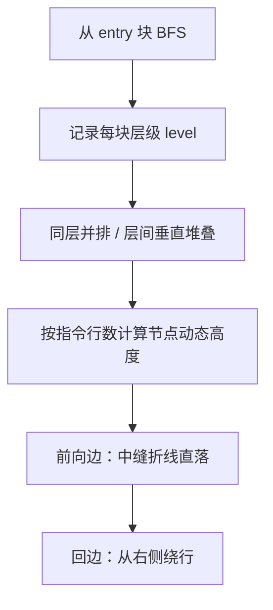

# 01 · 控制流图重绘

> 分类：可视化 ｜ 轮次：第二轮 ｜ 状态：已修复

## 现象

控制流图（CFG）在初版中把基本块**从上到下顺序堆叠**，没有层次概念：

- 分支结构完全看不出来，图更像一列普通列表；
- 边（连线）直接横穿节点，长边穿过多个块，可读性极差；
- 节点高度固定，长指令被裁切。

## 根因

初版渲染只做了「遍历基本块 → 依次放置 Y 坐标」，缺少：

1. **分层（layering）**：没有从入口做可达性 BFS 来分配层级；
2. **动态高度**：节点高度写死，未按指令行数计算；
3. **正交走线**：边直接用两点直线，必然穿过中间节点。

## 解决方案

引入一套小型的分层有向图布局：

关键点：

- `computeLevels()`：从 `isEntry()` 的块做 BFS，得到 `level` 映射；不可达块统一放到末尾层；
- 节点高度 = `HEADER_H + 行数 × LINE_H + 底部内边距`；
- 边用 `Polyline` 正交折线：前向边「下→横→下」，回边「右侧绕行」，末端加三角形箭头。

## 验证

- 对 `java.util.HashMap`、`IllegalArgumentException` 构造器等真实类生成 CFG，人工核对层次与走线；
- 全量构建与 14/14 单测通过。

## 教训

> 图布局的第一原则是**先分层，再放置**；顺序堆叠会丢失控制流的全部结构信息。
