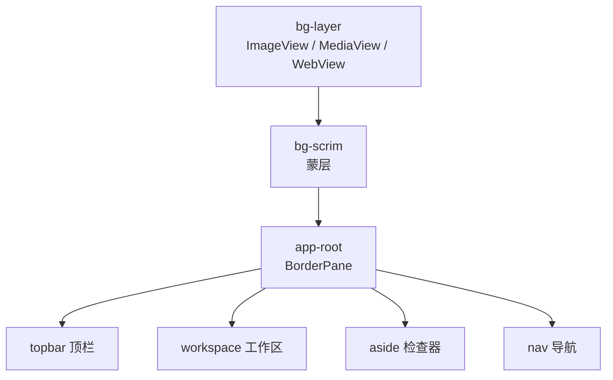
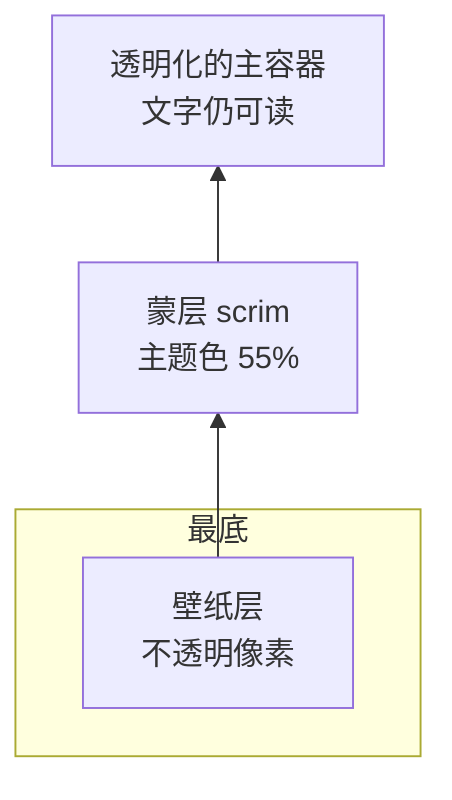

# 02 · 背景「已应用却不显示」

> 分类：渲染 / 层叠 ｜ 轮次：第一、二轮 ｜ 状态：已修复

## 现象

用户在背景库中点击「应用所选」，状态栏明明显示 *已应用背景: 吾王美如画*，但窗口依旧是纯色，完全看不到壁纸。

## 根因

背景层的结构是「壁纸层 → 半透明蒙层 → 应用根容器」三层叠加：



问题出在 `app-root` 及其子容器（`topbar / workspace / nav / aside / split-pane …`）
在 CSS 中都带有**不透明背景色**。壁纸层虽然在最底下，却被上面整片不透明容器完全遮住，
于是「看起来根本没换背景」。

此外，`bg-scrim` 当时只是一个很淡的主题色蒙层，并不能改变上层容器的不透明事实。

## 解决方案

在根节点加上 `bg-active` 样式类（启用背景时才添加），并在此类下**统一把主容器透明化**：

```css
.bg-active .app-root,
.bg-active .split-pane,
.bg-active .workspace,
.bg-active .workspace .tab,
.bg-active .nav,
.bg-active .aside,
.bg-active .topbar { -fx-background-color: transparent; }

/* 蒙层改用主题底色 + 降低不透明度，兼顾浅/深皮肤的可读性 */
.bg-active .bg-scrim { -fx-background-color: -ae-bg; -fx-opacity: 0.55; }
```

## 层叠关系（修复后）



## 验证

- 应用图片 / 视频 / 网页壁纸后，肉眼确认壁纸可透过工作区看到；
- 在 5 套皮肤（深色 4 套 + 浅色 1 套）下文字对比度仍可接受。

## 教训

> 「元素存在」≠「元素可见」。排障时要问：**在它上面还有谁都画了不透明背景？**
