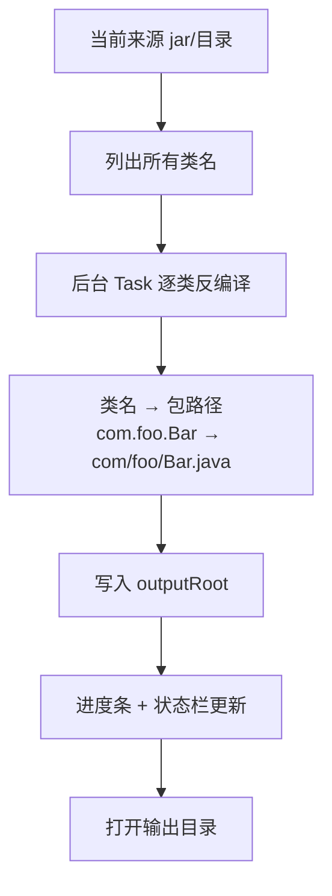

# 03 · 反编译导出完整 Java 源码

> 分类：功能 / IO ｜ 轮次：第一、二轮 ｜ 状态：已修复

## 现象

初版只提供「当前类预览」：选中一个类，右侧显示它的 Java。但用户点「打开目录」后，
打开的并非输出的工程目录，且磁盘上根本没有生成任何 `.java` 文件——所谓「反编译成 Java」
只是个毛坯。

## 根因

- 缺少「遍历整个来源 → 逐类反编译 → 按包结构落盘」的批处理流程；
- 没有可配置的**输出根目录**（`outputRoot`），也没有导出进度反馈；
- 「打开目录」误指向了别的路径。

## 解决方案

新增 `exportAllSources()`：用后台 `Task` 逐类反编译并落盘，进度回填状态栏。

要点：

- 输出路径 = `outputRoot / (类名.replace('.', '/') + ".java")`；
- `ensureOutputRoot()`：未设置时回退到 `~/AetherDecompiled`；
- 导出走后台线程，UI 通过 `ProgressBar` + `statusLabel` 呈现进度。

## 验证

- 对真实 jar 导出，磁盘上出现按包结构组织的完整 `.java` 树；
- 反编译后端实测：`WallpaperProject` 反编译出 8310 字符源码。

## 教训

> 「能预览」与「能交付」是两件事。用户要的是**可编译的源码树**，不是一段只读预览。
