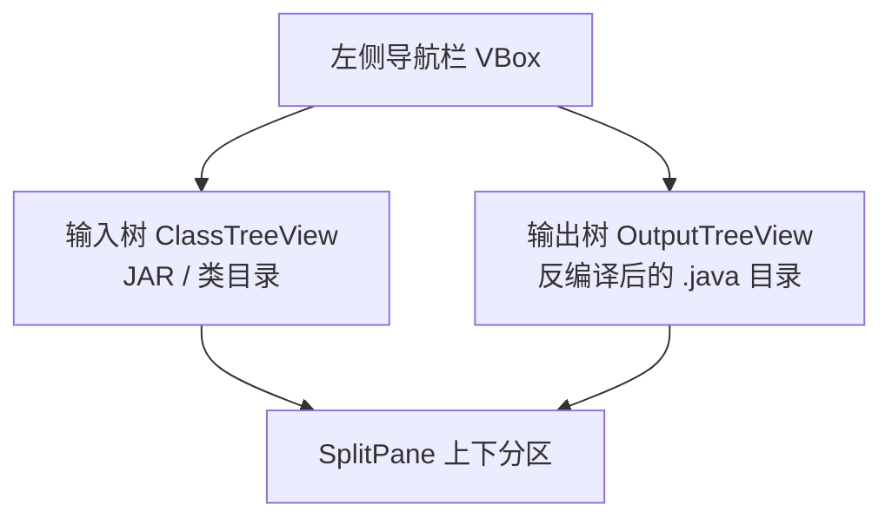

# 04 · 双目录树（JAR + 反编译输出）

> 分类：交互 / 布局 ｜ 轮次：第二轮 ｜ 状态：已修复

## 现象

左侧导航只有**一棵**类树（来自被分析的 jar）。用户看不到「反编译后生成的目录结构」，
难以把「输入」与「输出」对应起来。

## 需求

> 「左边窗口再加一个并行的就是反编译成代码后的目录结构，要有两个结构：一个是被编译的 jar，
> 一个是反编译后的目录。」

## 解决方案

新增 `OutputTreeView`，与既有 `ClassTreeView` 用 `SplitPane` **垂直并排**：

联动行为：

- 选中输入树中的类 → 打开反编译预览；
- 选中输出树中的文件 → 用 `openOutputFile()` 在编辑器打开该 `.java`；
- 导出完成后 `refreshOutputTree()` 刷新输出树。

## 验证

- 导出后输出树自动出现按包分层的目录；
- 点击输出文件可在代码视图打开。

## 教训

> 工具的「输入 → 处理 → 输出」应当在界面上**同时可见**，降低用户的认知负担。
