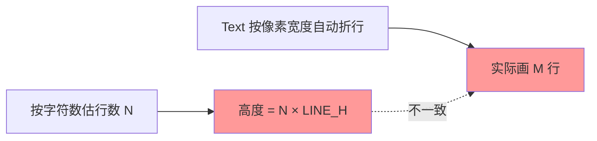
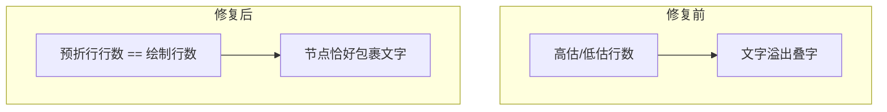

# 05 · 控制流图文字重叠

> 分类：可视化 ｜ 轮次：第三轮 ｜ 状态：已修复

## 现象

重绘后的 CFG 仍存在**节点内文字overflow、与相邻节点叠字**的问题。典型截图：
`B2` 节点里 `java/lang/IllegalArgumentException` 这行被折成两行、溢出到边框之外，
盖住了下一行；节点高度明显小于内容。

## 根因（关键）

节点高度计算与**实际绘制**用了两套不一致的折行逻辑：



- 高度用的是「按固定字符数折行」估出的行数；
- 而 `Text` 节点自身按**像素宽度**再折一次，像 `java/lang/IllegalArgumentException`
  这种长 token 会被额外折行；
- 结果 `M > N`，文字冲出节点边框，与下方节点/文本重叠。

## 解决方案

**统一到一套折行**：正文由视图**预先按等宽字符数折行**，并关闭 `Text` 的自动折行。

```java
// 关键：关闭自动折行。正文已按等宽字符数预折行，绘制行数与高度计算一致。
t.setWrappingWidth(0);
```

- `MAX_WRAP_CHARS = 46`（约 360px 节点宽 - 内边距，等宽 11px）；
- `wrapInsns()` 返回的行数**就是**最终绘制行数；
- 高度 = `HEADER_H + 行数 × LINE_H + PAD_BOTTOM`，二者严格一致。

## 修复前后对比



## 验证

- 用含超长类名的异常构造器生成 CFG，肉眼确认无溢出；
- 全量构建通过。

## 教训

> 布局里凡是「算尺寸」和「画内容」分开的地方，**必须共用同一套度量**，
> 否则就是叠字/裁切 bug 的温床。
