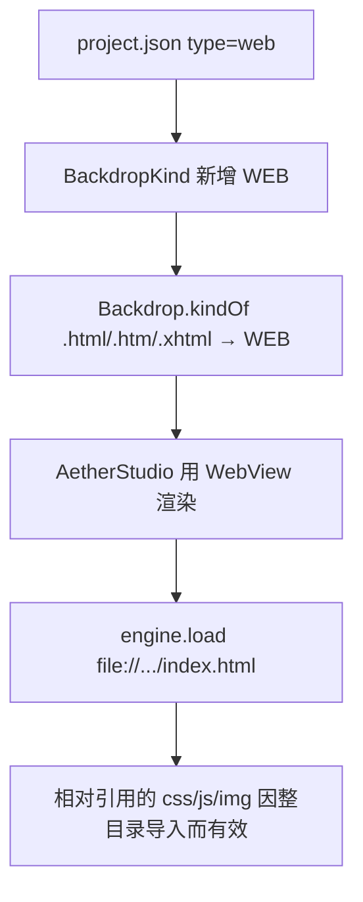

# 06 · 网页型壁纸黑屏

> 分类：渲染 / 媒体 ｜ 轮次：第三轮 ｜ 状态：已修复

## 现象

导入某些 Wallpaper Engine 壁纸（工程里是 `index.html` + `css/` + `js/` + `img/`）后，
背景是**全黑**，完全不可用。

## 根因

这类工程的 `project.json` 中 `type = "web"`，入口是 `index.html`，本质是**一个网页**，
必须用浏览器引擎渲染。

而 `BackdropKind` 当时只有 `IMAGE / VIDEO / NONE` 三种，`.html` 的
`kindOf()` 返回 `NONE`，于是 `applyBackdrop` 里所有分支都不命中——什么都不画，呈现黑屏。

## 解决方案

三步：

1. `BackdropKind` 增加 `WEB` 枚举；
2. `Backdrop` 增加 `WEB_EXT = {.html,.htm,.xhtml}`，`isWeb()`/`kindOf()` 支持；
3. `AetherStudio` 增加 `WebView bgWeb`，`applyBackdrop` 对 `WEB` 类型
   `bgWeb.getEngine().load(media.toUri().toString())`；同时先铺预览图作海报，避免加载期间黑屏。

依赖：`pom.xml` 增加 `javafx-web`（与 JavaFX 同版本）。

## 为什么整目录导入很关键

WebView 加载的是本地 `index.html`，其中对 `css/ js/ img/` 的引用是**相对路径**。
因此导入时必须是「整个工程文件夹整体复制」，相对引用才不会断。

## 验证

- 对 `898123863` 工程（`type=web`, `file=index.html`）导入并应用，背景正常渲染网页；
- 若入口文件缺失，状态栏提示「网页壁纸入口文件不存在」而非静默黑屏。

## 教训

> 「背景」不等于「图片/视频」。遇到新来源类型，**先扩展类型模型，再谈渲染**。
