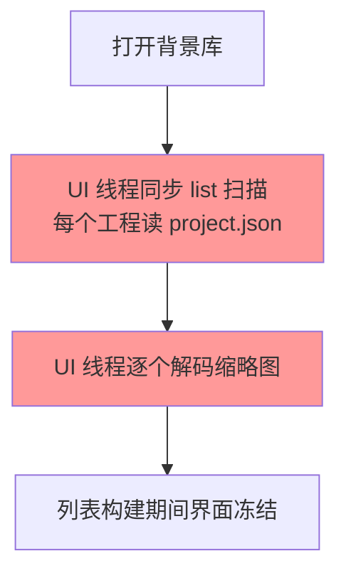
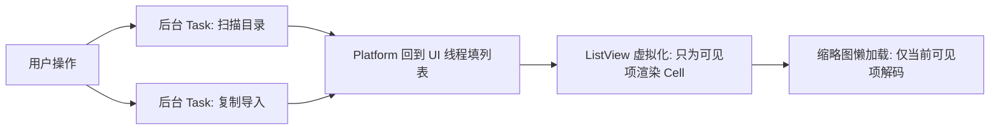

# 07 · 批量导入大量壁纸卡死

> 分类：并发 / 性能 ｜ 轮次：第三轮 ｜ 状态：已修复

## 现象

用户一次性把大量 Wallpaper 工程「复制粘贴」进背景库目录（`~/.aether/backgrounds`），
再打开背景库对话框后，程序**长时间未响应**，界面像卡死一样。

## 根因

两处都在 **JavaFX 应用线程（UI 线程）**上做重活：

1. `backdropLibrary.list()` 同步遍历目录、逐个解析每个工程的 `project.json`；
2. `BackdropCell.updateItem()` 里**每个可见单元格都同步 `new Image(...)`** 读图解码。

工程一多，UI 线程被这两件事占满，事件循环停顿，表现为「未响应」。

## 解决方案

- **扫描异步化**：`reloadGallery()` 用后台 `Task<List<Backdrop>>` 扫描，完成后回到 UI 线程填列表；
- **导入异步化**：`importIntoLibrary()` 把整目录复制放到后台 `Task`；
- **Cell 虚拟化**：`ListView` 本身虚拟化，只为可见项创建 `BackdropCell`，不再一次性解码全部缩略图；
- **占位反馈**：扫描期间列表 placeholder 显示「正在扫描背景库…」。

## 验证

- 一次性放入多个工程后打开对话框，界面保持可交互，扫描在后台完成；
- 状态栏显示「背景库共 N 项」。

## 教训

> UI 线程只做「画」和「响应」。任何 I/O、解码、解析都必须挪到后台，**用 Task + 回调回填**。
