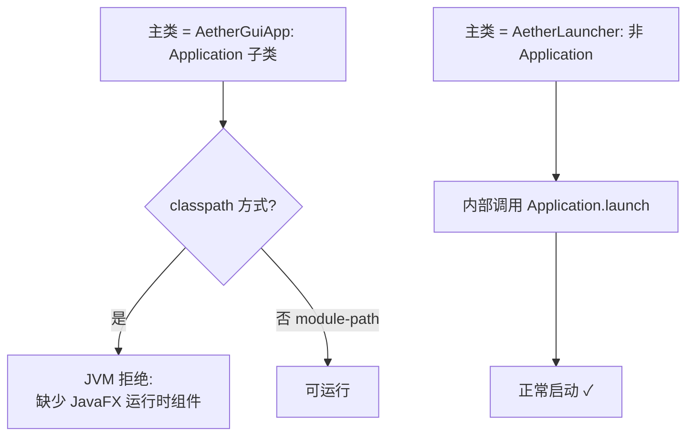

# 09 · JavaFX 启动类运行报错

> 分类：构建 / 运行时 ｜ 轮次：第一轮 ｜ 状态：已修复

## 现象

直接运行 `AetherGuiApp`（一个 `Application` 子类）作为主类时，报错：

```
错误: 缺少 JavaFX 运行时组件, 需要使用该组件来运行此应用程序
```

而运行另一个类却正常。

## 根因

当 JavaFX 以 **classpath**（而非 module-path）方式提供时，JVM 会拒绝任何
`Application` 子类作为**主类**——它要求由 JavaFX 的启动器机制来引导。



## 解决方案

引入**非 Application 的规范入口** `AetherLauncher`，由它间接调用
`Application.launch(AetherStudio.class, args)`：

```java
public final class AetherLauncher {
    public static void main(String[] args) {
        Application.launch(AetherStudio.class, args);
    }
}
```

配套：

- 所有启动脚本（`run-gui.sh` / `run-gui.bat`）与 fat jar 的 `Main-Class` 都指向 `AetherLauncher`；
- `AetherGuiApp` 保留为**兼容转发类**，内部转调 `AetherLauncher`，避免旧入口直接报错；
- README 增加排障说明：**只运行 `AetherLauncher`**，不要直接运行 `Application` 子类。

## 验证

- `java -jar aether-gui-studio.jar` 正常启动；
- IDEA 中直接运行 `AetherLauncher` 的 main 正常。

## 教训

> 框架约束要写进「入口设计」。**用一个薄启动器隔离框架限制**，是通用且低成本的做法。
