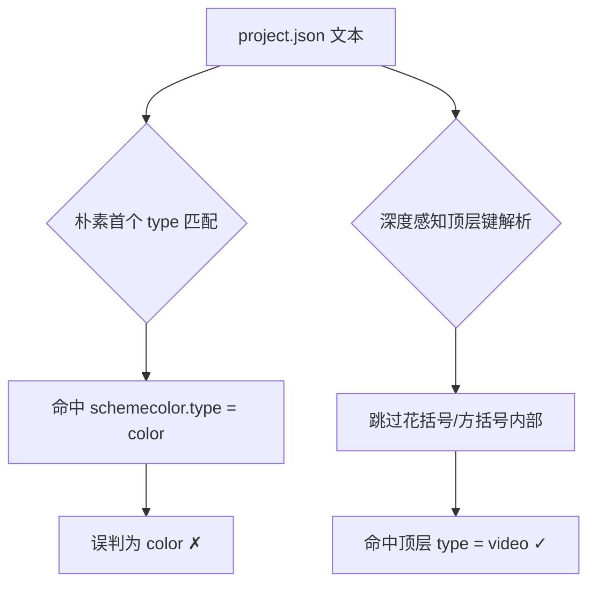

# 10 · Wallpaper `project.json` 解析错误

> 分类：解析 ｜ 轮次：第二轮 ｜ 状态：已修复

## 现象

导入 Wallpaper Engine 视频壁纸后，程序把类型识别成了 `color`，导致视频壁纸无法作为视频播放
（或直接失效）。真实工程明明写着 `"type": "video"`。

## 根因

`project.json` 里存在**同名的嵌套键**：

```json
{
  "file": "IMG_0505.mp4",
  "type": "video",              // ← 顶层，真正的类型
  "general": {
    "properties": {
      "schemecolor": {
        "type": "color",        // ← 嵌套，主题色的类型
        "value": "0.15 0.43 0.90"
      }
    }
  }
}
```

而 `schemecolor` **排在**顶层 `type` **之前**。用朴素的「首个 `"type"` 匹配」正则，
就会先命中 `"type": "color"`，把视频壁纸误判为 color 类型。



## 解决方案

重写为**深度感知的顶层键解析** `topLevelString(text, key)`：

- 逐字符扫描，用计数器跟踪 `{ }` / `[ ]` 的**嵌套深度**；
- 只匹配**深度为 1**（顶层）时出现的 `"key": "value"`；
- 于是嵌套在 `schemecolor` 内部的 `"type"` 被正确跳过。

同类修复：

- `schemeColor` 的值是**对象内**的字符串（`"value"`），不能按字符串直取，需先定位
  `"schemecolor":` 键，再在其后查找 `"value"` 字符串。

## 验证

- 对真实工程解析：`title=吾王美如画`、`type=video`、`media=IMG_0505.mp4`、
  `schemeColor=#2770e7`，全部正确。

## 教训

> 解析嵌套结构时，**永远不要用「第一个匹配」的正则**去取顶层字段——
> 一定要显式跟踪嵌套深度，或使用真正的 JSON 解析器。
