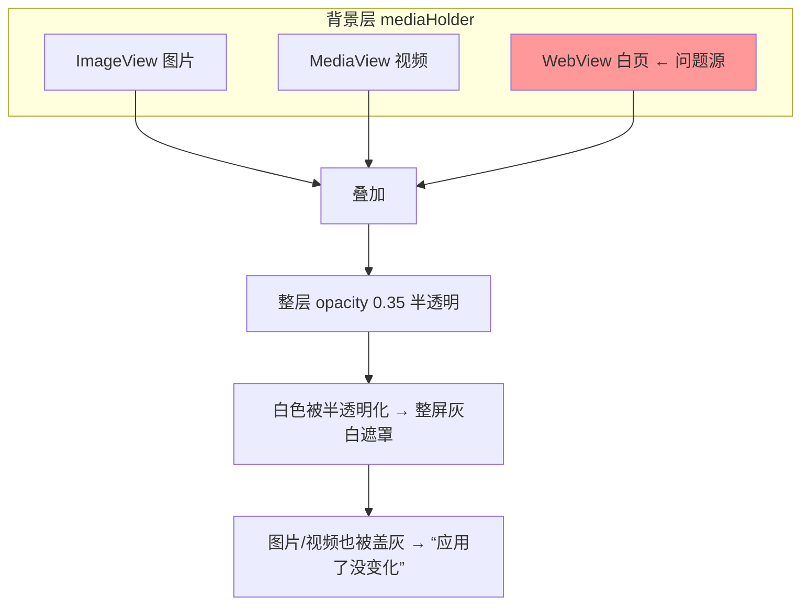

# 11 · 网页壁纸引入的「透明白遮罩」（回归缺陷）

> 分类：渲染 / 层叠 ｜ 轮次：第四轮（回归修复） ｜ 状态：已修复

## 现象

在加入网页型壁纸支持后，用户反馈出现了**新的回归缺陷**：整个界面蒙着**一层灰白色的
半透明遮罩**，非常难看；而且**点击「应用」没反应**——即便应用的是图片/视频壁纸，
画面也没有任何可见变化（状态栏却显示「已应用背景: 吾王美如画」）。

## 根因（关键）

引入 `WebView` 作背景时，它被**始终保留**在背景层里。而 WebView 在**未加载任何内容**时，
会渲染出一张**白色的空白页**。于是：



- 白页叠加 + 整层半透明 → **灰白遮罩**；
- 它盖在图片/视频之上 → 用户以为「应用无效」，其实是被白页盖住了。

## 解决方案

**只显示当前类型对应的渲染器**，并让网页壁纸在**加载成功后**再淡入：

```java
// 关键：WebView 默认隐藏，避免未加载时的白页形成遮罩
bgWeb.setVisible(false);
bgWeb.setOpacity(0);
bgWeb.getEngine().getLoadWorker().stateProperty().addListener((o, a, b) -> {
    if (b == Worker.State.SUCCEEDED) bgWeb.setOpacity(1);
});

// 应用背景后，只让“当前类型”的渲染器可见
boolean isVideo = backdrop != null && backdrop.kind() == VIDEO && videoPlayer != null;
boolean isWeb   = backdrop != null && backdrop.kind() == WEB;
bgVideo.setVisible(isVideo);
bgWeb.setVisible(isWeb);
bgImage.setVisible(bgImage.getImage() != null);
```

三个渲染器（图片 / 视频 / 网页）**互斥可见**：任一时刻只有一种在画，
从根上杜绝「空层叠加变色」。

## 验证

- 应用图片壁纸：只有图片可见，无白遮罩，画面立即变化；
- 应用网页壁纸：加载完成后淡入，加载期间显示预览海报而非白页；
- 应用视频壁纸：仅视频层可见。

## 教训

> 往层叠结构里加新图层时，**必须显式管理互斥可见性**。
> 「多加一层」看起来无害，实则可能悄悄改变整屏观感——这是最典型的回归缺陷。
