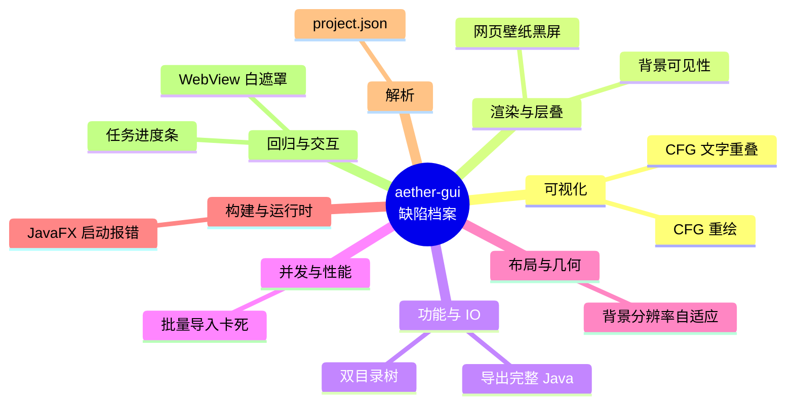
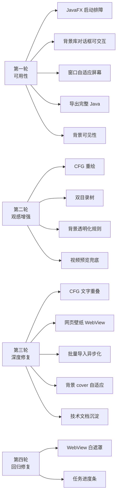
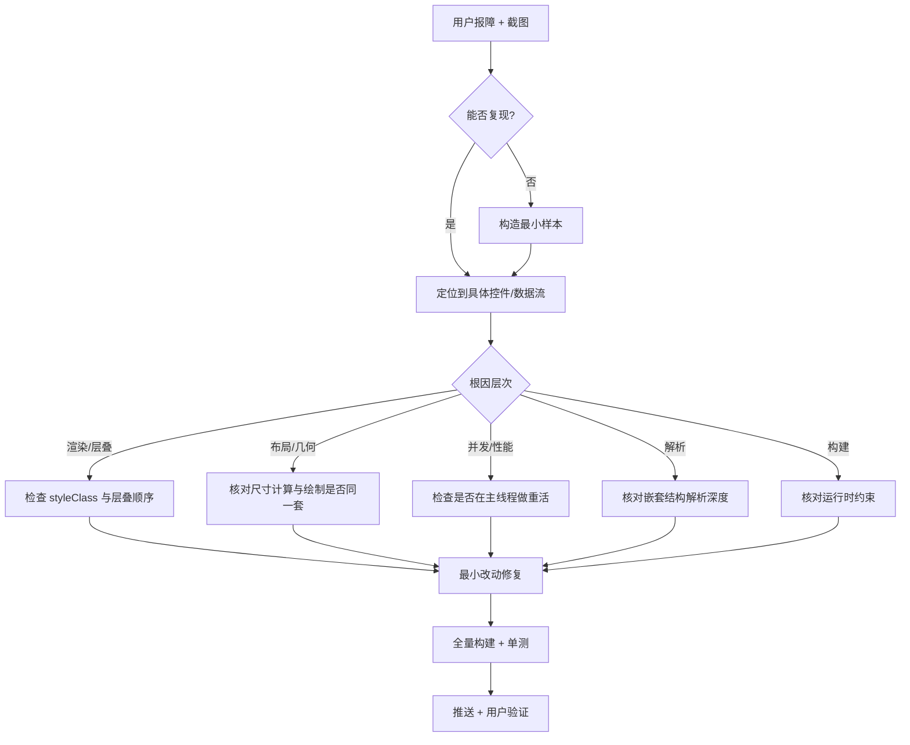

# aether-decompiler 技术问题档案

> 本目录系统性汇总 aether-gui 在「从能用 → 好用」三个迭代轮次中修复的每一类技术问题：
> 每篇都给出**现象 → 根因 → 解决方案 → 验证**，并尽量配一张 mermaid 图辅助理解。
>
> 作者：Jerry Zhu (Zeek) ｜ 座右铭：*Run the Code, Run the World!*

---

## 目录

| 编号 | 主题 | 分类 | 一句话根因 |
|------|------|------|-----------|
| [01](01-cfg-redraw.md) | 控制流图重绘 | 可视化 | 顺序堆叠、无分层、边横穿节点 |
| [02](02-backdrop-visibility.md) | 背景「已应用却不显示」 | 渲染/层叠 | 主容器不透明，把壁纸整片盖住 |
| [03](03-java-export.md) | 反编译导出完整 Java 源码 | 功能/IO | 只有单类预览，未落盘为完整工程目录 |
| [04](04-dual-tree-nav.md) | 双目录树（JAR + 反编译输出） | 交互/布局 | 只有输入树，缺少输出目录结构 |
| [05](05-cfg-overlap-fix.md) | 控制流图文字重叠 | 可视化 | 折行高度计算与绘制不一致，文本溢出叠字 |
| [06](06-web-wallpaper.md) | 网页型壁纸黑屏 | 渲染/媒体 | `type=web` 工程需 WebView 渲染，原先无此类型 |
| [07](07-bulk-import.md) | 批量导入大量壁纸卡死 | 并发/性能 | 主线程同步扫描 + 逐项解码缩略图 |
| [08](08-backdrop-resolution.md) | 背景分辨率自适应 | 布局/几何 | 拉伸变形、未按窗口比例贴合 |
| [09](09-javafx-launch.md) | JavaFX 启动类运行报错 | 构建/运行时 | classpath 下 Application 子类不能作主类 |
| [10](10-wallpaper-json-parse.md) | Wallpaper `project.json` 解析错误 | 解析 | 嵌套键 `schemecolor.type` 遮蔽顶层 `type` |
| [11](11-webview-white-veil.md) | 网页壁纸引入的透明白遮罩（回归） | 渲染/层叠 | WebView 未加载时的白页被半透明化成整屏遮罩 |
| [12](12-task-progress.md) | 任务进度条（空闲灰条） | 交互/并发 | 空闲不隐藏 + 任务未上报/绑定进度 |
| [15](15-ast-placeholder-and-gui-contrast.md) | AST 占位符 `/*?*/` 与配色/联动 | 解析/观感/交互 | 操作数分隔符是点而非斜杠，连锁击穿 new 合并与字段命名 |

---

## 按分类速览

---

## 迭代轮次与问题对应

---

## 修复方法论（可复用的排障套路）

---

## 阅读建议

- 想了解**为什么背景明明「已应用」却看不到**：先读 [02](02-backdrop-visibility.md) 与 [08](08-backdrop-resolution.md)。
- 想了解**图形渲染为什么不叠字**：读 [01](01-cfg-redraw.md) 与 [05](05-cfg-overlap-fix.md)。
- 想了解**桌面程序为什么会被海量文件卡死**：读 [07](07-bulk-import.md)。
- 想了解**JavaFX 工程结构上的坑**：读 [09](09-javafx-launch.md)。
