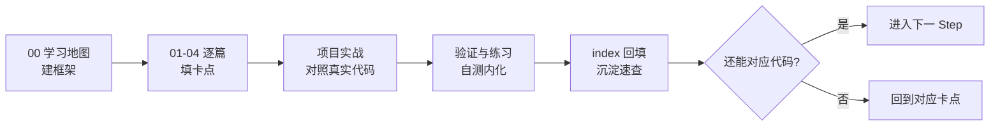

# aether-decompiler 学习文档

> 这是为你（Jerry Zhu / Zeek）个人学习定制的**分阶段学习文档库**。
> 风格：**框架优先、一次一屏、卡点标注、验证闭环**；每阶段是一个 `StepN/` 文件夹。
>
> 重点：**SSA / AST / 代码分析技术**——这块按「成体系」标准组织，每阶段都能俯瞰、可回访。

## 阶段导航

| 阶段 | 主题 | 入口 | 状态 |
|------|------|------|------|
| **Step1** | 架构入门：字节码 / 内核 / 插件 / 流水线 / GUI | [Step1/00-学习地图.md](Step1/00-学习地图.md) | ✅ 已就绪 |
| **Step2** | **SSA 静态单赋值**（支配边界 / phi / 版本化） | [Step2/00-学习地图.md](Step2/00-学习地图.md) | ✅ 已就绪（Phase2 落地） |
| **Step3** | **AST 抽象语法树**（表达式重建 / 控制结构恢复） | [Step3/00-学习地图.md](Step3/00-学习地图.md) | ✅ 已就绪（Phase3 落地） |
| **Step4** | SourceMapping 源码映射（双向定位） | [Step4/00-学习地图.md](Step4/00-学习地图.md) | ✅ 已就绪（Phase4 落地） |
| **Step5** | 流水线 / 缓存 / 并行（生产级工程） | [Step5/00-学习地图.md](Step5/00-学习地图.md) | ✅ 已就绪（Phase5 落地） |

> 每个 Step 都遵循同一结构：`00 学习地图`（建框）→ `01/02/03`（逐点填卡点）→
> `0x 项目实战`（对照本仓库真实代码）→ `0x 验证与练习`（自测）→ `index`（速查回访）。

## 怎么用这套文档

## 出口标准（满足即算内化）

- **Step1**：说清「字节 → 模型 → CFG」每段产出；默写 4 扩展点；解释 JavaFX 主类坑。
- **Step2**：解释「为什么循环需要 phi」；手算一个 if-else 的支配边界；验证每条 SSA 值只定义一次。
- **Step3**：说明「为什么 AST 不含关键字」；手推一段算术的栈变化；预测循环头与汇合点。
- **Step4**：解释「映射是渲染副产品」；说清半开区间约定；验证双向查询。
- **Step5**：解释「为什么缓存对象必须不可变」；解释「内核为什么不拥有线程池」。

> 学习契约：**结论能对应现实代码 = 学会**。每篇都以「现实验证」收尾，不要只读不做。

---

*Copyright 2026 Jerry Zhu (Zeek) · Apache-2.0 · Run the Code, Run the World!*
