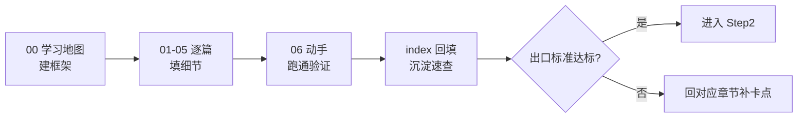

# aether-decompiler 学习文档

> 这是为你（Jerry Zhu / Zeek）个人学习定制的**分阶段学习文档库**。
> 风格：**框架优先、一次一屏、卡点标注、验证闭环**；每阶段是一个 `StepN/` 文件夹。

## 阶段导航

| 阶段 | 主题 | 入口 | 状态 |
|------|------|------|------|
| **Step1** | 架构入门：字节码 / 内核 / 插件 / 流水线 / GUI | [Step1/00-学习地图.md](Step1/00-学习地图.md) | ✅ 已就绪 |
| Step2 | SSA 单静态赋值 + 栈类型推断 | （待生成） | ⏳ 规划中 |
| Step3 | AST 还原 + Java 渲染（替换 CFR） | （待生成） | ⏳ 规划中 |

## Step1 文件清单

| 文件 | 内容 | 你该拿它做什么 |
|------|------|---------------|
| [`00-学习地图.md`](Step1/00-学习地图.md) | 总纲 + 框架俯瞰 + 阅读顺序 + 出口标准 | 先读这个，建立全局 |
| [`01-字节码基础.md`](Step1/01-字节码基础.md) | `.class` 结构、常量池、栈式指令 | 认识原料 |
| [`02-内核架构.md`](Step1/02-内核架构.md) | ASM 薄包装、不可变模型、CFG、支配树 | 认识工厂 |
| [`03-插件契约.md`](Step1/03-插件契约.md) | 4 扩展点 + 三大冻结 | 认识接口 |
| [`04-流水线.md`](Step1/04-流水线.md) | 字节→模型→CFG→SSA→AST；为什么 SSA/AST 不动 | 认识流程 |
| [`05-GUI外壳.md`](Step1/05-GUI外壳.md) | 视图 / 皮肤 / 背景 / JavaFX 主类坑 | 认识外壳 |
| [`06-动手实践.md`](Step1/06-动手实践.md) | 6 个可复现实验 + 验证清单 | 动手内化 |
| [`index.md`](Step1/index.md) | 速查索引（学完回填） | 回访唤醒记忆 |

## 怎么用这套文档

## 出口标准（满足即进入 Step2）

- 能说清「字节 → 模型 → CFG」每段产出什么；
- 能默写 4 个插件扩展点；
- 能解释 SSA / AST 现在为什么不动；
- 能解释 JavaFX 主类的坑；
- 能复现默认背景 + 三填充模式 + 导出进度。

> 学习契约：**结论能对应现实代码 = 学会**。所以每篇都以「现实验证」收尾，
> 不要只读不做。

---

*Copyright 2026 Jerry Zhu (Zeek) · Apache-2.0 · Run the Code, Run the World!*
