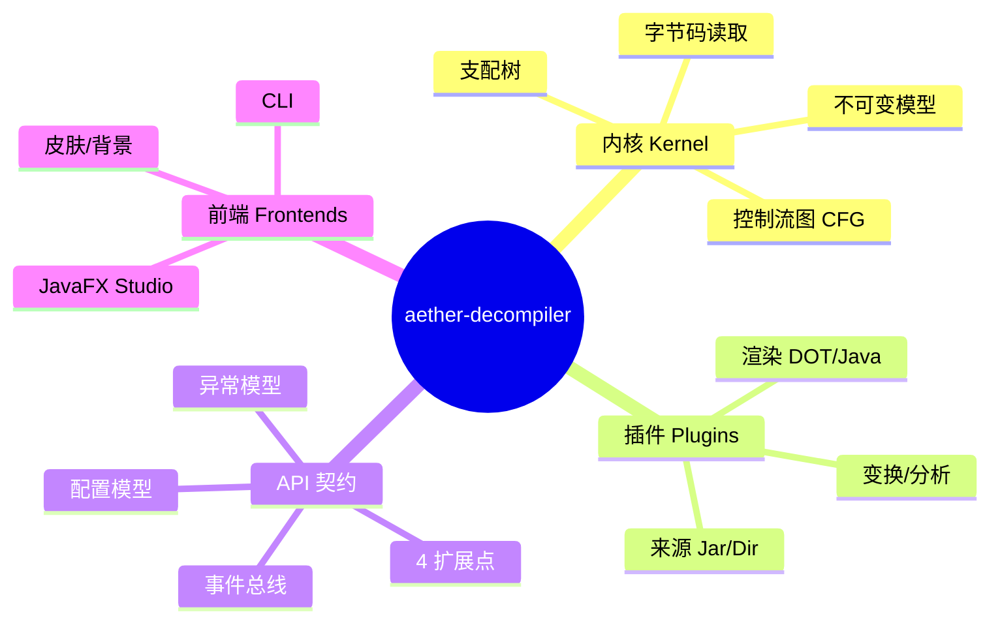

# Step1 · 学习总纲与学习地图

> 学习主题：**aether-decompiler —— 一个可复用 JVM 反编译引擎**（内核/插件/GUI 分层）
> 交付形态：随仓库学习文档 ｜ 风格：框架优先、一次一屏、卡点标注、验证闭环
> 作者：Jerry Zhu (Zeek) ｜ 座右铭：*Run the Code, Run the World!*

## 一句话本质

aether-decompiler = **把「一堆 `.class` 字节」翻译回「人能读的结构」的一条流水线**；
内核只做字节码的数学模型（读取 → 建模 → 控制流），所有可选能力（渲染成 Java / 画图 / 分析）
都下沉为**插件**，CLI 与 GUI 只是它的两种外壳。

## 为什么它是「史诗级」项目

| 维度 | 普通小工具 | aether-decompiler |
|------|-----------|-------------------|
| 定位 | 单个可执行程序 | **引擎 + 插件 + 多种前端**的平台 |
| 内核边界 | 什么都塞一起 | 只留字节码数学，其余全下沉 |
| 可扩展 | 改源码 | 实现 4 个扩展点即插即用 |
| 学习价值 | 学一个功能 | 学**架构分层、IR 设计、编译原理、桌面 GUI、并发** |

## 学习地图（俯瞰框架）



## 模块骨架（= 你代码里的真实目录）

```text
学习主题：aether-decompiler
├── aether-plugin-api   ← 契约层（4 扩展点 / 配置 / 异常 / 事件 / IR）
│   └── ⚠️ 卡点：为什么先冻结 API，再写实现？（见 03）
├── aether-core         ← 内核（ASM 包装 / 不可变模型 / CFG / 支配树）
│   └── ⚠️ 卡点：字节码栈式模型怎么变成「块 + 边」？（见 04）
├── aether-plugins      ← 官方插件（source-jar / render-dot / render-java）
│   └── ⚠️ 卡点：反编译到 Java 为什么先外包给 CFR？（见 04）
├── aether-cli          ← 命令行外壳
├── aether-gui          ← JavaFX 桌面外壳（视图 / 皮肤 / 背景）
│   └── ⚠️ 卡点：为什么 Application 子类不能当主类？（见 05）
└── doc/                ← 你正在读的这里
```

## Step1 的边界（先学什么，不学什么）

| 学 | 暂不深挖 |
|----|---------|
| 字节码 / class 文件结构 | JIT 即时编译细节 |
| ASM 薄包装、不可变模型 | 完整 JVM 指令语义表 |
| CFG 构建、支配树 | SSA 构建算法（Step2） |
| 插件契约、引擎主循环 | AST 还原算法（Step3） |
| JavaFX 外壳与构建运行 | 分布式/远程渲染 |

## 阅读顺序（建议）

1. `01-字节码基础` —— 先认识原料
2. `02-内核架构` —— 再看工厂
3. `03-插件契约` —— 再看接口
4. `04-流水线` —— 看原料怎么流过工厂
5. `05-GUI 外壳` —— 看成品怎么呈现
6. `06-动手实践` —— 亲手跑通
7. `index` —— 学完回填速查索引

## 验证清单（Step1 出口标准）

| 模块 | 验证方式 | 可运行例子 |
|------|---------|-----------|
| 字节码基础 | 预测输出 | 用 `javap -c` 对照本引擎的字节码视图 |
| 内核架构 | 出题 | 说出「模型」与「CFG」各属于哪条流水线阶段 |
| 插件契约 | 画框 | 默写 4 个扩展点的名字与职责 |
| 流水线 | 调试 | 观察右侧流水线状态：哪三步亮、哪两步灰、为什么 |
| GUI 外壳 | 运行 | `mvn -pl aether-gui -am install` 后跑起 Studio |

## 速查索引（学完回填）

- [ ] 字节码基础 → 一句话 + 场景
- [ ] 内核架构 → 一句话 + 场景
- [ ] 插件契约 → 一句话 + 场景
- [ ] 流水线 → 一句话 + 场景
- [ ] GUI 外壳 → 一句话 + 场景
