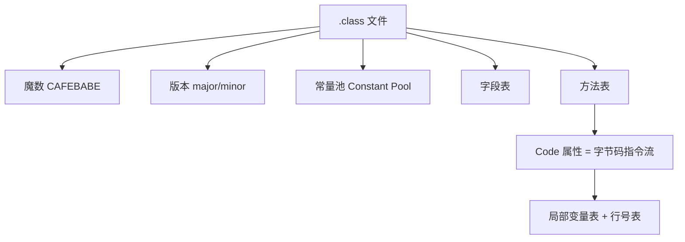

# Step1-01 · 字节码基础：反编译的「原料」

## 一句话本质

`.class` 文件 = **常量池 + 元数据 + 一串栈式指令**；反编译，就是把这串栈式指令
反向还原成人能读的结构。

## 俯瞰框架



| 部件 | 作用 | 反编译时关心什么 |
|------|------|-----------------|
| 魔数 `CAFEBABE` | 标识 class 文件 | 校验入口 |
| 版本号 | `major 45` 等 | 决定可用的指令/特性 |
| 常量池 | 字符串/类名/方法名/描述符池 | `java/lang/Object` 都指向这里 |
| 字段/方法表 | 成员清单 | 生成类结构 |
| `Code` 属性 | 真正的方法体指令 | 反编译的主战场 |

### 指令长什么样

```text
0: aload_0
1: invokespecial java/lang/Object.<init>()   // 调父类构造
4: putfield  this.name
```

- 前面是 **指令序号**（不是行号）；
- 后缀 `_0/_1` 是**隐式局部变量槽**（`aload_0` = 读第 0 个槽，通常是 `this`）；
- 冒号后是**指令助记符**，操作数指向常量池。

## 关键卡点

1. ⚠️ **栈式模型 ≠ 寄存器模型**：JVM 用**操作数栈**传递中间结果，没有「变量 =
   表达式」的直接写法。所以反编译必须**先用栈状态分析**（Step2 的 SSA），
   才能把 `load→load→add→store` 还原成 `c = a + b`。
2. ⚠️ **指令序号不是源码行号**：`0,1,4` 之间有空隙（`2,3` 可能属于被截断的常量索引），
   别当成「跳过了行」。
3. ⚠️ **同一个操作有多个变体**：`iload_0`（隐式）vs `iload 5`（显式带索引），
   语义相同、编码不同，解析时要归一化。

## 现实验证

1. 对本项目跑 `java -jar aether-gui-studio.jar`，打开一个类 → 切到「字节码」标签；
2. 同机开个终端跑 `javap -c -p <你的类>`，逐条对照；
3. 自测：看到 `putfield` 时，问自己「它在写哪个字段？值从栈顶来还是槽里来？」

> 内化标准：能指着任意一条指令，说出**它吃几个栈值、吐几个栈值**。
