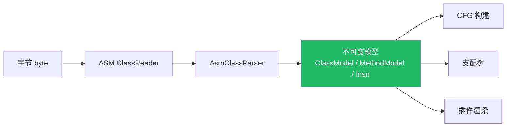

# Step1-02 · 内核架构：不可变模型与 ASM 薄包装

## 一句话本质

内核 = **用 ASM 把字节读进来，立刻转成自己的一套不可变模型，之后所有处理都不再碰 ASM**。

## 俯瞰框架

| 类 | 职责 | 关键性质 |
|----|------|---------|
| `AsmClassParser` | ASM → 自有模型 | 唯一接触 ASM 的地方 |
| `ClassModel` | 类级不可变模型 | record 风格，构造即冻结 |
| `MethodModel` / `Insn` | 方法/指令模型 | `index()` 定位，`kind()` 标 IR 类型 |
| `BasicBlock` | 基本块 | `id` == 在 CFG 列表中的位置 |
| `ControlFlowGraph` | 块 + 边 | 后继/异常后继 |
| `DominatorTree` | 支配关系 | 用于结构化识别 |

## 为什么「不可变」是内核的护城河

| 若可变 | 不可变（本项目） |
|--------|-----------------|
| 插件 A 改了下游看到被污染 | 每层产出即快照，互不干扰 |
| 并发要加锁 | 天然线程安全、可缓存 |
| 难以回溯 | 任何阶段都能回放 |

## 关键卡点

1. ⚠️ **只在最外层引 ASM**：一旦模型建好，插件**永远看不到 ASM 类型**——
   否则 ASM 升级会炸穿所有插件。这是「薄包装」的纪律。
2. ⚠️ **`Insn.index()` vs `Insn.offset()`**：本项目模型只有 `index()`（在指令列表里的下标），
   没有 `offset()`。别照抄老代码的 `offset()`。
3. ⚠️ **`BasicBlock.id` 语义**：它等于该块在 CFG 列表中的**位置**，不是随机 id，
   所以可以拿来做数组下标。

## 现实验证

1. 打开 `aether-core/.../model/ClassModel.java`，找到 `kind()` 返回 `IRKind.CLASS_MODEL`；
2. 在引擎里下断点/打印：一个类从 byte 到 `ClassModel` 只经过 `AsmClassParser` 一次；
3. 自测题：**如果 ASM 从 9.7.1 升级到 10，需要改几个模块？**（答案：理论上只改 `aether-core`，
   因为插件只依赖自有模型。）
