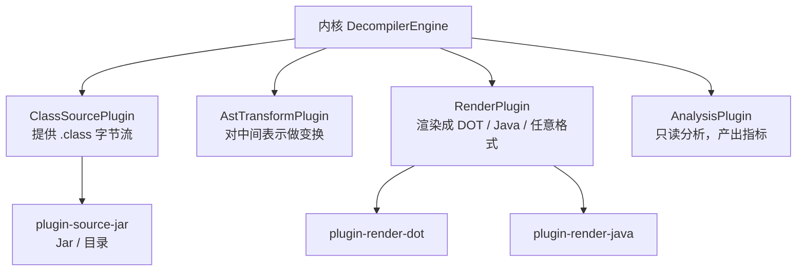

# Step1-03 · 插件契约：4 个扩展点与三大冻结

## 一句话本质

插件系统 = **内核只认 4 个接口**；谁能提供字节、谁能变换、谁能渲染、谁能分析，
都通过这 4 个口子挂进来，内核本体永不修改。

## 俯瞰框架

| 扩展点 | 输入 | 输出 | 本项目实例 |
|--------|------|------|-----------|
| `ClassSourcePlugin` | 路径/配置 | `ClassSource` 字节流 | jar / 目录来源 |
| `AstTransformPlugin` | 中间表示 | 变换后表示 | （待 Phase2+） |
| `RenderPlugin` | 模型/CFG | 文本/文件 | DOT、Java |
| `AnalysisPlugin` | 模型/CFG | 指标/报告 | 方法度量 |

## 三大「Phase0 冻结」（不可破坏性修改）

| 冻结项 | 内容 | 为什么必须早冻结 |
|--------|------|-----------------|
| 配置模型 | `Options`（不可变快照）+ `OptionRegistry` | 插件都靠它读参数，晚改会全量返工 |
| 异常模型 | `AetherException` 单根 + `ErrorCode` | 异常是公共契约，插件要按码处理 |
| SourceMapping | `node ↔ 指令范围 ↔ 行号` | 三视图联动的地基，越晚做越贵 |

## 关键卡点

1. ⚠️ **「先冻结接口再写实现」不是形式主义**：接口是**别人依赖你的地方**，
   实现是**你依赖自己的地方**。前者改一次贵十倍。
2. ⚠️ **扩展点数量要克制**：4 个足够覆盖「来源 / 变换 / 渲染 / 分析」四象限；
   每加一个都要问「能不能归到已有象限」。
3. ⚠️ **插件之间禁止直接依赖**：只能通过 `PluginContext` + 事件总线通信，
   否则又变成大泥球。

## 现实验证

1. 打开 `aether-plugin-api` 源码，默写 4 个接口名（`ClassSourcePlugin`、
   `AstTransformPlugin`、`RenderPlugin`、`AnalysisPlugin`）；
2. 跑 CLI：`java -jar aether-cli.jar <某个jar>`，观察 `Discovered N plugin(s)`；
3. 自测题：**「把类图导出成 PNG」应该实现哪个扩展点？**（答：`RenderPlugin`。）
