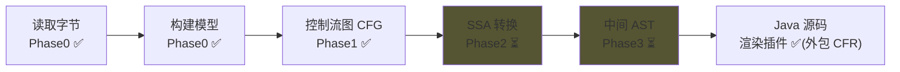
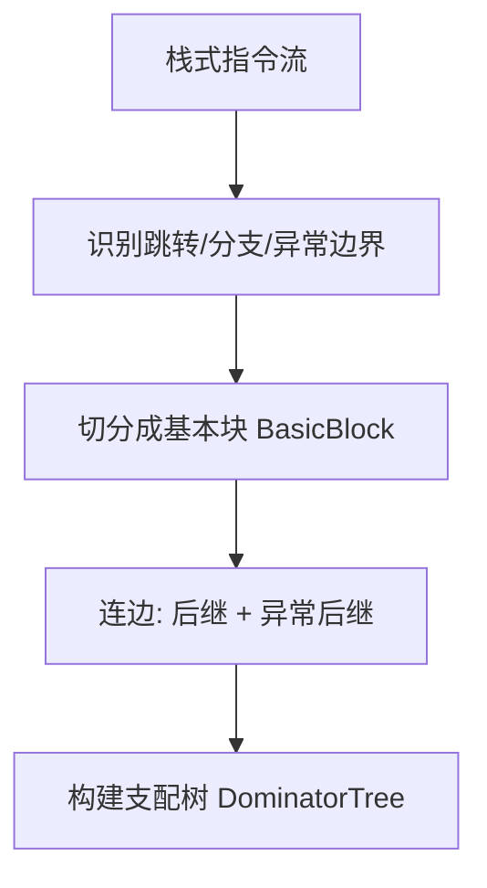

# Step1-04 · 反编译流水线：从字节到结构，以及 SSA / AST 是什么

## 一句话本质

反编译 = **一条分阶段流水线**：字节 → 模型 → 控制流图 → （SSA）→（AST）→ 源码；
本项目已完成**前三段**，SSA 与 AST 是**后两段**（尚未实现），所以你看到它们「不动」。

## 俯瞰框架



| 阶段 | 产出 | 状态 | 对应 IRKind |
|------|------|------|-------------|
| 读取字节 | 原始 class 字节 | ✅ | `BYTES` |
| 构建模型 | `ClassModel`/`MethodModel`/`Insn` | ✅ | `CLASS_MODEL`/`METHOD_MODEL` |
| 控制流图 | `ControlFlowGraph` + `DominatorTree` | ✅ | `CFG` |
| SSA | 每变量只赋值一次的中间表示 | ⏳ | （待定） |
| AST | 与平台无关的结构树 | ⏳ | （待定） |
| 渲染 Java | `.java` 文本 | ✅ | 由 CFR 直接生成 |

### CFG 是怎么从「一条条指令」变出来的



- **基本块**：一段「一进一出、中间不跳」的指令序列（入口块标 `entry`）；
- **边**：分支方向、异常处理方向；
- **支配树**：回答「到达 B 是否必经 A」，是识别 `if/while` 结构的基础。

### SSA 是什么（Step2 预习）

字节码里同一变量槽会被反复赋值、读取，像**一本被很多人涂改的流水账**。
SSA（Single Static Assignment，单静态赋值）给**每次赋值发一个新名字**：

```text
普通形式：            SSA 形式：
x = 1                 x1 = 1
x = x + 1             x2 = x1 + 1
y = x                 y1 = x2
```

好处：**每个变量只被赋值一次**，谁依赖谁一目了然，类型推断/变量还原才做得动。

### AST 是什么（Step3 预习）

把 SSA 清理后的指令，还原成带**结构层级**的树：`if / while / for / switch / try`。
- CFG 像一张「道路图」（有 goto 跳转）；
- AST 像一张「建筑蓝图」（楼层 + 房间层级）。
之后 Java 源码只是 AST 的一种**渲染格式**（换成 C#/Kotlin 只是换渲染器）。

## 关键卡点

1. ⚠️ **为什么 SSA 和 AST 一直灰着**：它们是 Phase2/Phase3，**尚未实现**，
   只是流水线面板上的占位状态，不是 bug。
2. ⚠️ **现在能出 Java 代码 ≠ SSA/AST 已完成**：当前靠 `plugin-render-java`
   **外包给 CFR**（一个成熟反编译器）直接出 Java，绕过了自研两条流水线。
   等 Phase2/3 落地，CFR 才会被替换——这是「借用轮子」到「自造引擎」的分水岭。
3. ⚠️ **支配树 ≠ 必经判断**：支配是「所有路径都经过」，别和「常见路径」混。

## 现实验证

1. 打开任一类的右侧「流水线状态」面板：✅ 读取字节 / ✅ 构建模型 / ✅ 控制流图，
   ⏳ SSA / ⏳ AST —— 对照上表理解每一行；
2. 看「当前方法度量」：方法数 / 基本块 / 控制流边 / 指令总数，理解 CFG 的规模；
3. 自测题：**「把 CFG 还原成带缩进的 if-else」属于哪一阶段？**（答：Phase3 AST。）
