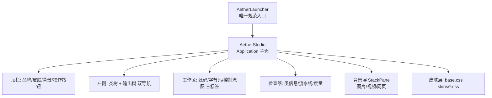

# Step1-05 · JavaFX 桌面外壳：视图、皮肤与背景

## 一句话本质

GUI = 一个 JavaFX `Application`，把内核的**模型/CFG/源码**分别交给不同**视图**渲染，
并叠加一层可换的**皮肤**与可换的**背景**。

## 俯瞰框架



| 视图 | 文件 | 展示 |
|------|------|------|
| 代码编辑器 | `CodeEditorView` | RichTextFX 源码 + 行号 + 高亮 |
| 字节码 | `BytecodeView` | 指令列表 + 方法高亮 |
| 控制流图 | `CfgView` | 分层节点 + 正交边 + 箭头 |
| 类树 | `ClassTreeView` | 输入类导航 + 搜索 |
| 输出树 | `OutputTreeView` | 反编译后的 `.java` 目录 |
| 事件流 | `EventsView` | 线程安全日志 |
| 检查器 | `InspectorView` | 类信息 / 流水线 / 度量 / 署名 |

## 关键卡点

1. ⚠️ **`Application` 子类不能当主类（classpath 方式）**：JVM 会报
   「缺少 JavaFX 运行时组件」。解法：用一个**非 Application** 的 `AetherLauncher`
   去调用 `Application.launch(...)`。
   ```mermaid
   flowchart LR
       A["主类 = Appendix 子类"] -->|classpath| X["JVM 拒绝 ✗"]
       B["主类 = AetherLauncher（非 App）"] -->|launch| OK["正常启动 ✓"]
   ```
2. ⚠️ **背景「白遮罩」陷阱**：`WebView` 未加载内容时会画**白页**，
   叠加半透明后形成整屏灰白遮罩。必须**默认隐藏 + 加载后淡入 + 三渲染器互斥可见**。
3. ⚠️ **UI 线程只做「画」和「响应」**：扫描/复制/解码一律放后台 `Task`，
   否则批量导入会「长时间未响应」。

## 皮肤与背景两套可选系统

| 系统 | 目录 | 机制 |
|------|------|------|
| 皮肤 | 内置 `skins/*.css` + 用户 `~/.aether/skins` | CSS 变量主题化，5 套内置 |
| 背景 | 内置 `resources/backgrounds/bundled` + 用户 `~/.aether/backgrounds` | 首启播种 + 图片/视频/网页三类 |

## 现实验证

1. 构建：`mvn -pl aether-gui -am clean install`；
2. 运行：`java -jar aether-gui-studio.jar`（**不要**直接运行 `AetherGuiApp`）；
3. 交替切换 5 套皮肤与三类背景，观察界面不崩、背景即刻生效、无白遮罩；
4. 自测题：**为什么状态栏进度条空闲时要隐藏？**（答：否则永远留一条无意义的空灰条。）
