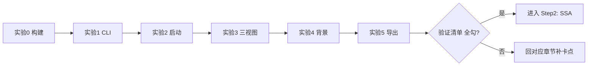

# Step1-06 · 动手实践：亲手跑通一遍

> 目标：把「框架知识」变成「手上的肌肉记忆」。每一步都给你**命令 + 预期结果**。

## 实验 0 · 构建全量

```bash
cd aether-decompiler
mvn clean install
```

**预期**：7 个模块 `BUILD SUCCESS`；单测全绿。
**卡点**：首次会下载依赖，慢是正常的，别中断。

## 实验 1 · 跑 CLI，看插件被发现

```bash
java -jar aether-cli/target/aether-cli-0.1.0-SNAPSHOT.jar <你的某个 jar>
```

**预期**：输出 `Discovered N plugin(s)` 和 `Done: X class(es), Y DOT file(s)`。
**观察**：这就是 `ClassSourcePlugin` + `RenderPlugin` 协作的证据。

## 实验 2 · 启动 Studio

```bash
java -jar aether-gui-studio.jar
```

**预期**：出现深色 IDE 风格界面。
**坑点题**：如果换 `java -cp ... AetherGuiApp` 会报 JavaFX 运行时组件缺失——为什么？
（回看 05，答案：Application 子类不能当 classpath 主类。）

## 实验 3 · 三视图联动

1. 「打开 JAR」选一个 jar；
2. 左侧点一个类 → 右侧「源码 / 字节码 / 控制流图」切换；
3. 看控制流图：**节点分层、边正交、无叠字**；
4. 看右侧「流水线状态」：前三行亮 ✅，SSA/AST 灰 ⏳ —— 说出原因。

## 实验 4 · 默认背景

1. 顶栏「背景 / 外观」打开背景库；
2. 应该能看到**随仓库播种的默认背景图**（来自 `resources/backgrounds/bundled`）；
3. 选一张应用 → 背景立即显示、无白遮罩；
4. 切「铺满窗口 / 拉伸填充 / 等比适应」三模式，理解覆盖与留边区别。

## 实验 5 · 导出源码

1. 点「设置输出目录」选一个空目录；
2. 点「导出全部源码」；
3. **观察进度条按文件数逐步填充**；
4. 完成后左侧「输出树」出现按包分层的 `.java` 目录。

## 验证清单（打勾即可推进 Step2）

- [ ] 能说清「字节 → 模型 → CFG」三段各产出什么
- [ ] 能默写 4 个插件扩展点
- [ ] 能解释 SSA / AST 为什么现在不动
- [ ] 能解释 JavaFX 主类的坑
- [ ] 能复现「默认背景 + 三填充模式 + 导出进度」


