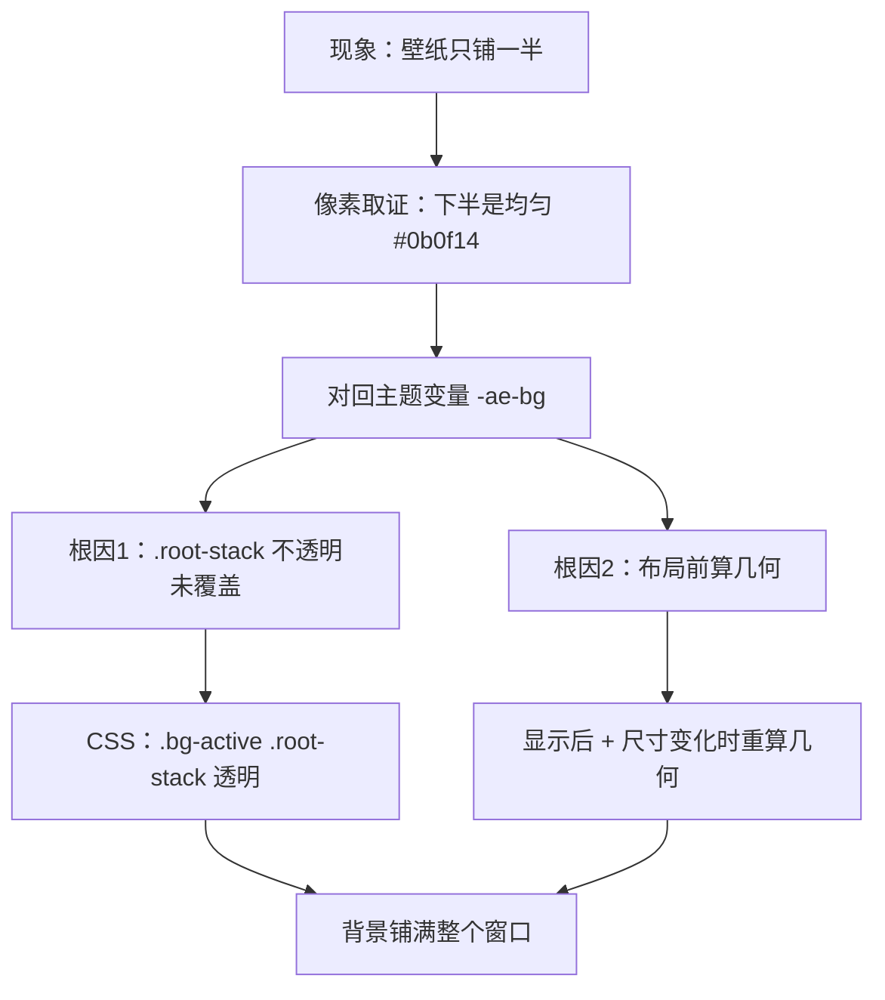
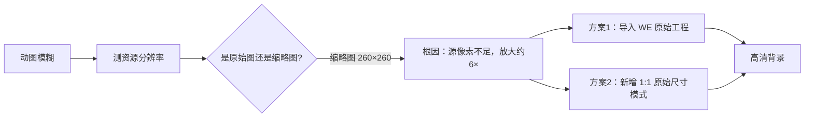
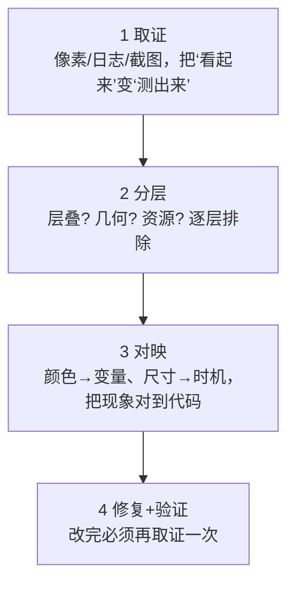

# Step1-07 · 实战排错经验：把「背景只铺一半 / GIF 模糊」变成架构认知

> 学习主题：**从一次真实 GUI 缺陷里，学会「层叠 + 几何 + 资源分辨率」三类根因的定位方法**。
> 风格：现象 → 取证 → 根因 → 解决 → 验证，一次一屏，卡点标注。
> 作者：Jerry Zhu (Zeek) ｜ 座右铭：*Run the Code, Run the World!*

## 一句话本质

**背景渲染的“怪象”，90% 不是“绘制代码写错了”，而是三个更隐蔽的层面之一出错：**
① **层叠**（有没有别的层把它盖住）、② **几何**（它的尺寸/裁剪是不是按真实窗口算的）、
③ **资源**（喂进来的像素本身够不够清晰）。这一章就是照这三层依次取证的实战复盘。

---

## 案例一 · 背景「铺满窗口却只填了一半」

### 现象

点「应用」后，背景像是**只铺满了窗口的上半部分**，下面是一条纯色带（下方还留着空白）。
直觉上会以为：是不是 `cover` 缩放算错了比例？

### 第一步取证：别猜，先量

排错第一原则——**把“看起来”变成“测出来”**。做法是对界面截图做像素分析：

- 逐行统计亮度，发现 y≈45–565 是彩色壁纸，**y≥577 起整行宽度都是同一个值 (11,15,20)**；
- 关键判据：一条**横跨整个窗口宽度、颜色完全均匀**的色带，**不可能是照片内容**
  （照片永远有色阶与噪点）——它只能是一块**纯色面板**。

### 第二步：把色值对回主题

把 (11,15,20) 换算成十六进制 = `#0b0f14`，正好等于皮肤变量 **`-ae-bg`**。
于是问题从“缩放对不对”变成了——**哪个元素在画这个底色、并且盖住了壁纸？**

### 第三步：查层叠清单

背景层的结构是：

```text
rootStack (StackPane)
 ├─ mediaHolder   ← 壁纸（bgImage / bgVideo / bgWeb）
 ├─ bg-scrim      ← 半透明压暗层
 └─ app-root      ← 整个应用界面（BorderPane）
```

启用背景时会给 `rootStack` 加 `.bg-active` 类，靠 CSS 把各主容器**透明化**，让壁纸透出来。
逐个核对后发现：

- `.app-root / .split-pane / .workspace / .nav / .aside / .event-dock / .statusbar` 都已在透明清单里；
- **但最外层的 `.root-stack` 自己仍在画 `-ae-bg`，且不在清单里** —— 而它铺满整个窗口。

### 根因（两条，互相叠加）

| # | 根因 | 表现 |
|---|------|------|
| 1 | `.root-stack` 自身不透明、未被 `.bg-active` 覆盖 | 壁纸没盖到的地方露出 `#0b0f14` 纯色带 |
| 2 | `applyFillLayout()` 在**场景/布局尺寸就绪前**执行 | 用错误的宽高算 `cover` 裁剪，几何本身就偏 |

第 2 条解释了为什么“偏偏是上/下一半”：首次计算时窗口高度还没定稿，
裁切矩形按错误的高度算出，于是内容只覆盖了一部分。

### 解决



**改动三处：**

1. **CSS**：给透明清单补上最外层根容器
   ```css
   /* 根 StackPane 默认铺满主题底色，启用背景时必须透空，
      否则未被壁纸覆盖的区域会露出一条纯色带，看起来“只铺了一半”。 */
   .bg-active .root-stack { -fx-background-color: transparent; }
   ```
2. **几何时机**：窗口 `show()` 之后、以及每次宽高变化时，重新校准一次背景几何
   （把“首次布局前尺寸未就绪”这个坑填掉）。
3. **几何实现**：`cover` 不再依赖「StackPane 居中 + 外层裁剪」这种脆弱组合，
   改为 **viewport 居中裁剪**——见下面的“关键技法”。

### 关键技法：用 viewport 做「永不形变、永远铺满」的 cover

`cover` 的目标是“保持比例、放大到完全覆盖、多余部分裁掉”。与其放大节点再让父层裁剪，
不如**把节点的显示尺寸精确设为窗口尺寸，只对源图做居中裁剪**：

```java
// 1:1 思路：让 viewport（取景框）与窗口同比例，再拉伸铺满，即可无变形 cover
private static Rectangle2D centerCrop(double iw, double ih, double w, double h) {
    double winAspect = w / h, srcAspect = iw / ih;
    if (srcAspect > winAspect) {        // 源图更宽 → 裁掉左右
        double vw = ih * winAspect;
        return new Rectangle2D((iw - vw) / 2.0, 0, vw, ih);
    }
    double vh = iw / winAspect;         // 源图更高 → 裁掉上下
    return new Rectangle2D(0, (ih - vh) / 2.0, iw, vh);
}
```

**为什么这样更稳？** 节点尺寸恒等于窗口尺寸，无论窗口怎么变都不会“露出半块底”；
裁剪交给取景框，**既不形变、也不依赖外部裁剪框的坐标**。

---

## 案例二 · GIF 动图模糊，想要 1:1 高清

### 现象

同一个动图背景，在软件里“糊”，远不如在 Wallpaper Engine 桌面上清晰。

### 根因：喂进来的像素本身就不够

排查资源分辨率后发现——**用的根本不是原始动图，而是 Wallpaper Engine 的“预览缩略图”**：

| 文件 | 实际分辨率 | 说明 |
|------|-----------|------|
| `2004955866.gif` | **260×260** | WE 列表用的缩略图 |
| `1477067414.gif` | 280×280 | 同上 |
| 某 `*.jpg` | 1024×1024 | 静态预览图 |

把 260px 的图放大到 1600+px 的窗口 = 放大约 **6 倍**，**模糊是物理必然**，
再好的抗锯齿也救不回不存在的细节。所以这不是“渲染模糊”，而是**拿错了源**。

### 解决（两条路，建议都做）

1. **导入 Wallpaper Engine 原始工程目录**，而不是单张缩略图。
   软件会读取工程里的**原始媒体文件**（视频 / 原始动图），从源头拿到高清像素。
2. **新增「原始尺寸 (1:1)」填充模式**：按源图分辨率 1:1 显示、**绝不放大**。
   适合你想要“像素级保真、看细节”的场景；代价是小图不会填满窗口。

### 验证

- 换成原始工程或原始动图后，背景锐利、无放大锯齿；
- 切到「原始尺寸 (1:1)」，画面与源文件分辨率一致、无插值放大。



---

## 方法论提炼：GUI 缺陷排错的通用四步



| 步骤 | 口诀 | 本项目对应 |
|------|------|-----------|
| ① 取证 | 别猜，先量 | 逐行亮度分析发现“均匀色带” |
| ② 分层 | 层叠 / 几何 / 资源 | 先查谁在盖，再查尺寸，最后查源像素 |
| ③ 对映 | 现象 → 符号 | `#0b0f14` ↔ `-ae-bg`；时机 ↔ `applyFillLayout` |
| ④ 闭环 | 改完再验证 | 重新构建 + 复现确认 |

> **一句心法**：*“覆盖问题先查层叠，变形问题先查几何，模糊问题先查资源。”*

---

## 本章验证清单

- [ ] 能说清「纯色带 = 不透明层」这个判据，以及为什么照片不会产生均匀色带
- [ ] 能解释 `viewport 居中裁剪` 为什么比「放大 + 外部裁剪」更稳
- [ ] 能说出「布局前算几何」为什么会算错，以及怎么修
- [ ] 能解释「缩略图 vs 原始媒体」为什么决定清晰度
- [ ] 能默写排错四步：取证 → 分层 → 对映 → 闭环
